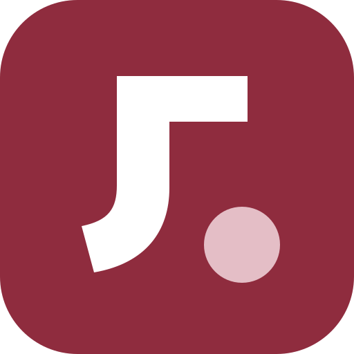

<p align="center">
  
</p>

<h1 align="center">JLU GPA Calculator for Windows Desktop</h1>

<p align="center">
  面向吉林大学本科生的本地绩点与成绩规划工具
</p>

<p align="center">
  <a href="https://github.com/Coldymemos/JLU-GPA-Calculator-for-Windows-Desktop/actions/workflows/desktop.yml"></a>
  
  
  <a href="LICENSE"></a>
</p>

网页端版本请前往 [JLU GPA Calculator for Web](https://github.com/DailyPotato/JLU-GPA-Calculator) 查看。桌面端与网页端数据相互独立。

JLU GPA Desktop 可以在本机管理课程成绩，计算保研 GPA、加权平均分和算术平均分，并模拟未来还需要修读多少课程、取得什么成绩才能达到目标。所有课程数据和计算过程均保存在本机，不需要上传成绩单。

> 走过路过点个star谢谢喵！

> [!IMPORTANT]
> 本项目不是吉林大学官方软件。不同学院、专业和年级适用的计算规则可能不同，请先核对相关文件并按实际情况调整规则。计算结果仅供个人参考。

## 主要功能

| 功能           | 说明                                                                             |
| -------------- | -------------------------------------------------------------------------------- |
| 三类成绩计算   | 计算保研 GPA、加权平均分和算术平均分，并展示纳入与排除课程                       |
| 未来课程规划   | 输入目标值，反推所需课程数、课程学分和模拟成绩，查看不同未来成绩下的敏感度       |
| 成绩表导入     | 导入 `.xls`、`.xlsx`、`.csv`，支持多工作表、导入预览、表头映射和逐行问题报告     |
| 教务系统导入   | 在应用内打开吉林大学 VPN，用户手动登录并点击官方导出后自动进入导入预览           |
| 目录批量导入   | 扫描整个目录，识别成绩表、处理重复文件，并提供逐文件导入报告                     |
| 自定义计算规则 | 分别设置三类结果的课程类型、关键词和课程号排除规则，保存多套规则并进行结果对照   |
| 多档案管理     | 为不同阶段或不同计算方案建立独立成绩档案，课程、规则和设置互不影响               |
| 本地备份       | 使用 SQLite 保存数据，支持手动备份、完整性校验、恢复前副本以及每日或每周自动备份 |
| 结果导出       | 将结果导出为 PNG、PDF 或 Excel，也可以直接写入指定目录                           |

同一课程号存在多条记录时，默认保留有效成绩最高的一条参与计算；同名但课程号不同的课程不会自动合并。

## 下载与安装

前往 [Releases](https://github.com/Coldymemos/JLU-GPA-Calculator-for-Windows-Desktop/releases) 获取 Windows x64 安装包：

- `*-setup.exe`：适合大多数用户的安装程序；
- `*.msi`：适合使用 Windows Installer 部署的用户。

如果 Releases 页面暂时没有可用安装包，可以按照下方的[从源码运行](#从源码运行)说明自行构建。

应用支持 Windows 10/11 x64，并依赖 Microsoft Edge WebView2 Runtime。多数较新的 Windows 系统已经预装 WebView2。当前安装包未进行商业代码签名，因此 Windows 首次运行时可能显示安全提示，请只从本仓库的 Releases 页面下载安装包。

## 快速上手

1. 打开应用，在“课程”页面手动添加课程，或点击“从教务系统导入”，在应用内窗口完成 VPN 和教务系统登录后点击官方导出。
2. 检查导入预览、字段映射和异常行，确认后保存课程；应用不会读取或保存 VPN 账号密码。
3. 在“计算规则”和各结果的“排除规则”中核对当前计算口径。
4. 点击“开始计算”，查看保研 GPA、加权平均分和算术平均分。
5. 打开“目标规划”，输入目标值和每门模拟课学分，查看未来课程与成绩需求。
6. 需要留存结果时，在“结果导出”中选择 PNG、PDF 或 Excel。

规划功能只创建临时模拟课程，不会修改或保存到当前成绩档案。当前自动反推按每门模拟课程相同学分、成绩 60–100 分、最多 40 门课程进行搜索；生成方案后可以继续手动调整每门课的学分和成绩。

## 数据与隐私

- 除用户主动使用教务系统导入外，应用不需要登录账号；教务登录在内嵌网页中完成，账号密码不会交给应用保存；
- 应用不会把课程和成绩上传到服务器；
- 桌面数据保存在 `%APPDATA%\com.coldymemos.jlugpa.desktop\jlu-gpa-desktop.sqlite3`；
- 手动备份和自动备份均由用户选择保存位置；
- 恢复数据库前会检查 SQLite 完整性和 SHA-256 校验和，并保留恢复前副本；
- 提交 Issue 或错误报告时，请勿上传包含真实姓名、学号或成绩的文件和截图。

## 当前范围

当前版本支持 Excel/CSV 成绩表和手动录入，暂不支持把 PDF 成绩单或扫描图片作为导入源，也不提供 OCR。这里的限制只针对成绩单导入，计算结果仍然可以正常导出为 PDF。

## 从源码运行

开发环境需要：

- Node.js 22；
- pnpm 11；
- Rust stable；
- Visual Studio 2022 C++ 构建工具；
- Microsoft Edge WebView2。

```powershell
git clone https://github.com/Coldymemos/JLU-GPA-Calculator-for-Windows-Desktop.git
cd JLU-GPA-Calculator-for-Windows-Desktop
pnpm install --frozen-lockfile
pnpm tauri dev
```

常用命令：

| 命令               | 说明                                          |
| ------------------ | --------------------------------------------- |
| `pnpm tauri dev`   | 启动桌面开发环境                              |
| `pnpm check`       | 运行 lint、格式、测试、类型检查和前端生产构建 |
| `pnpm tauri build` | 生成 Windows 应用、MSI 和 NSIS 安装包         |

项目使用 React、TypeScript、Tauri 2 和 SQLite。

## 反馈与贡献

如果你发现计算口径、导入格式或界面行为存在问题，可以提交 [Issue](https://github.com/Coldymemos/JLU-GPA-Calculator-for-Windows-Desktop/issues)。提交前请移除所有真实个人信息和成绩数据。

- 作者：Coldymemos
- 共同作者：DailyPotato

## License

本项目源码按 [PolyForm Noncommercial License 1.0.0](LICENSE) 提供。允许在非商业目的下使用、研究、修改和分享；任何商业用途均需事先取得作者授权。

本项目属于源码可用（source-available）软件，不属于 OSI 定义下的开源软件。
